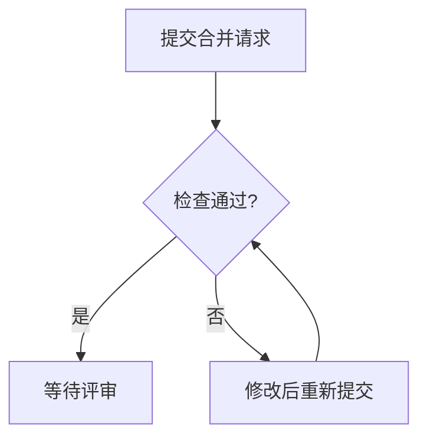

# 块的写法

目录：提示框、状态标签、时间线、指标卡、图表、流程图、分栏、折叠、脚注、公式、HTML。

照下面的样子写，空格和换行也照抄：改文档时要逐字引用原文，文档存下来就是这个样子。写错了，写入会被拒，返回里写着哪一行、正确的写法是什么。

## 提示框

```
> [!IMPORTANT]
> 推荐方案 A：现成的扩展最多，一个月能上线。
```

类型：NOTE（补充）、TIP（建议）、IMPORTANT（结论、决定）、WARNING（风险）、CAUTION（会出事的操作）。一篇文档里提示框不超过三个。

## 状态标签

`{✓ 文字}` 表示是、通过、会发生；`{✗ 文字}` 表示否、不通过、不会发生；`{! 文字}` 表示有风险、待定。正文、表格、时间线里都能用。

## 时间线

每项写「时间或序号 | 标题」，下一行缩进两格写一两句说明，说明可以不写；标题后面可以跟状态标签。

```
:::timeline
- 10:02 | 提交合并请求 {✓ 单元测试} {✗ 类型检查}
  类型检查报了 2 处错误。
- 10:15 | 修好后重新提交 {✓ 单元测试} {✓ 类型检查} {! 等待评审}
:::
```

## 指标卡

每行写「名称 | 数值 | 变化」，变化可以不写；最多六项。

```
:::stats
- 活跃项目 | 128 | +12%
- 首字时间 | 6.1 秒 | -27%
:::
```

## 图表

里面只放一张表格：第一列是横轴或分类，其余每列是一组数。格子里只写数，可以带 , % 和货币符号，单位写进表头。

```
:::chart line
| 周     | 改版前（次） | 改版后（次） |
| ----- | ------ | ------ |
| 第 1 周 | 1,020  | 1,980  |
| 第 2 周 | 1,060  | 2,150  |
| 第 3 周 | 1,070  | 2,290  |
:::
```

类型：bar（比大小）、line（看趋势）、area（看趋势和总量）、stacked（比总量和组成）、pie（看占比，表格只有两列）、scatter（看两个数的关系，第一列也是数）。分类名长或项目多时写 `:::chart bar horizontal`，柱子横着画。饼图、柱状图、折线图都用图表块，不用 mermaid 的 pie 和 xychart。

## 流程图

用 mermaid，只用 flowchart、sequenceDiagram、gantt、stateDiagram：



一张图不超过 8 个节点，从上往下画（TD），每个判断最多两条分支，节点里的字不超过 10 个。带具体时刻的事件用时间线块，不用 mermaid 的 timeline。

## 分栏

两到三栏：

```
::::columns
:::column
**方案 A**

一个月上线。
:::
:::column
**方案 B**

两周上线。
:::
::::
```

## 折叠

```
<details><summary>原始数据</summary>

这里写 Markdown 内容。

</details>
```

## 脚注

正文写 `[^1]`，文末单独一行写 `[^1]: 说明`。脚注只做两件事：解释一个名词，写出一个数的来源或算式。免责、补充论点、「仅供参考」都不写进脚注。

## 公式

行内写 `$...$`，单独一段写

```
$$
E = mc^2
$$
```

金额里的 `$` 照常写：`$` 后面紧跟数字的不算公式。

## HTML

除了 details、summary、sub、sup、kbd、br、mark，不要用其他 HTML 标签。
