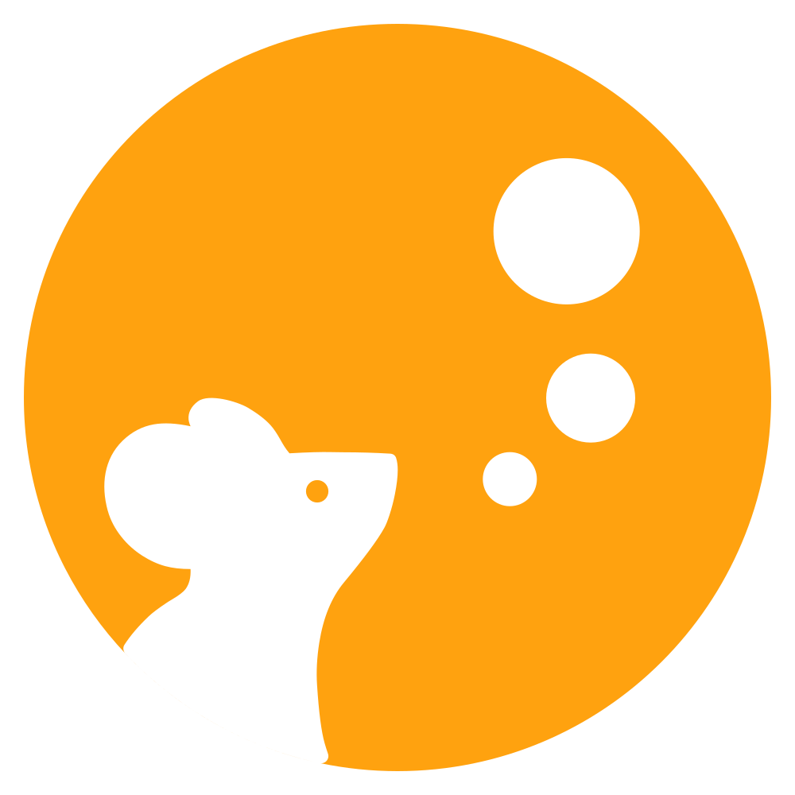
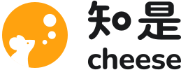
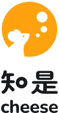

# 知是品牌标识

标志怎么组成、什么时候用哪一种、怎么放。界面里的颜色、字号等其余视觉规则见 [`design-system.md`](design-system.md)。

## 1. 标志由什么组成

| 部分 | 文件 | 说明 |
|---|---|---|
| 图形标 | [`logo.svg`](../frontend/src/assets/logo.svg)（品牌色）、[`logo-plain.svg`](../frontend/src/assets/logo-plain.svg)（单色） | 一轮满月，一只老鼠从月亮前探出头，三个孔从它鼻尖前冒出来 |
| 中文字标 | [`brand/wordmark-zh.svg`](../frontend/src/assets/brand/wordmark-zh.svg) | 「知是」 |
| 英文字标 | [`brand/wordmark-en.svg`](../frontend/src/assets/brand/wordmark-en.svg) | 小写 `cheese` |

<p>

&nbsp;&nbsp;&nbsp;

&nbsp;&nbsp;&nbsp;

</p>

所有文件都由脚本生成（§8），不要手改，也不要用字体重新打出「知是」或 `cheese` 来代替字标：字标里的改动字体里没有，打出来的是另一个样子。

## 2. 图形标

- **老鼠**是原标志里设计师手绘的那只，只保留它挡在月亮前的剪影和眼睛。它是整个标志唯一手绘的部分，源文件是 [`scripts/brand/mouse.svg`](../scripts/brand/mouse.svg)。
- **三个孔**说明这是奶酪。它们从鼻尖前面起，一个比一个大，孔和孔的间距也逐级放大，圆心落在同一条弧上，像老鼠在想事情。孔的大小是 34 : 56 : 92。
- **一种颜色**：品牌色 `#FFA20F`，平涂，不加渐变。

## 3. 字标

### 3.1 中文

以思源柔黑（Resource Han Rounded）粗体为底，改了四处：

- **「知」的「口」换成圆环**，环的粗细和其他笔画相同，和图形标上的孔呼应。
- **整体压到九成高**，字形更敦实。圆环不跟着压，单独按正圆放回原处。
- **「是」的「日」收窄**：宽度是原来的八成六，圆角是框高的三成，笔画粗细不变。「是」因此上窄下宽，重心更稳。
- **「是」的撇和捺重画**：字体原来的撇头是一个圆球，捺是从细到粗的楔形，把左下角挤成一团。现在两笔都是和横画同粗的单线，两端圆头，捺顺着一道弧转平，连进底横。

两个字之间的空隙固定，不随使用场合调整。

### 3.2 英文

Nunito 781，按字体自带的字偶间距排，再整体收紧 10/1000 em。字重是按中英上下排时配出来的：英文缩到和「知是」同宽，此时英文笔画约为中文的八成。

## 4. 组合

| 组合 | 浅色底 | 深色底 | 用在哪 |
|---|---|---|---|
| 横排 · 中文 | [`lockup-zh-light`](../frontend/src/assets/brand/lockup-zh-light.svg) | [`lockup-zh-dark`](../frontend/src/assets/brand/lockup-zh-dark.svg) | 中文界面的顶栏、页脚 |
| 横排 · 英文 | [`lockup-en-light`](../frontend/src/assets/brand/lockup-en-light.svg) | [`lockup-en-dark`](../frontend/src/assets/brand/lockup-en-dark.svg) | 英文界面的顶栏、页脚 |
| 横排 · 中英 | [`lockup-zh-en-light`](../frontend/src/assets/brand/lockup-zh-en-light.svg) | [`lockup-zh-en-dark`](../frontend/src/assets/brand/lockup-zh-en-dark.svg) | 中文场合里需要同时出现英文名的地方：文档封面、演示、对外材料 |
| 上下排 · 中英 | [`lockup-stacked-light`](../frontend/src/assets/brand/lockup-stacked-light.svg) | [`lockup-stacked-dark`](../frontend/src/assets/brand/lockup-stacked-dark.svg) | 方形或竖长的版面：启动页、海报 |

<p>

&nbsp;&nbsp;

&nbsp;&nbsp;

&nbsp;&nbsp;

</p>

一个画面里只出现一次标志。中文界面用中文，英文界面用英文，不要在界面里两种都放。

组合文件里的图形标是品牌色，用于对外材料。产品界面里的品牌位用单色图形标，和字标同色，由 `BrandLockup` 组件拼出，见 §9。

组合里的比例以图标高度 H 为准，文件里已经排好，照原样缩放即可：

| 组合 | 字标高度 | 图标与字标的间距 |
|---|---|---|
| 横排 · 中文 | 0.54 H | 0.3 H |
| 横排 · 英文 | 0.5 H | 0.3 H |
| 横排 · 中英 | 「知是」宽 = 0.56 H × 其宽高比；`cheese` 与它同宽，两行相隔 0.11 H | 0.26 H |
| 上下排 · 中英 | 两行同宽，都为 0.96 H，两行相隔 0.1 H | 图标下方 0.2 H |

## 5. 应用图标与首页方块

| 用途 | 文件 | 画法 |
|---|---|---|
| 网站图标 | [`favicon.svg`](../frontend/public/favicon.svg)、`favicon.ico` | 白色圆角方块，一圈 `#E5E3DF` 细边，图形标占七成 |
| PWA、iOS 主屏 | `pwa-192x192.png`、`pwa-512x512.png`、`apple-touch-icon-180x180.png` | 白色满底，图形标占七成；圆角由系统裁 |
| PWA 可裁切图标 | `pwa-maskable-512x512.png` | 同上，图形标只占五成，留在系统的安全圆里 |
| 下载页 | [`app-icon.png`](../frontend/src/assets/app-icon.png) | 白色圆角方块，自带圆角和细边 |
| 桌面客户端 | `desktop/src-tauri/icons/` | 由 `desktop/icon-source.png` 生成，见 §8。macOS 不替应用裁形状，所以源图就是苹果模板的形状：1024 的透明方块里居中一块 824 的白色圆角方块，带细边 |
| 登录页动效 | `brand-scene/logo-*.png` | 彩色贴图是图形标本身；热成像那张是 Paper Shaders 处理过的，见 §8 |
| 通知邮件 | `email-mark.png` | 图形标本身，透明底：邮件客户端不显示 SVG，白色方块在深色模式的信里会是一块白斑 |

**首页方块**是侧栏首页那一格（悬停和选中时）、主页面在桌面客户端里的启动画面、桌面客户端的启动页：品牌色平涂的方块，上面压深色 `#23242a` 的图形标，两个主题下一样。两张启动页必须像素一致，里面的图形标都由脚本写入。

## 6. 颜色

- 图形标只用品牌色 `#FFA20F` 或单色。单色版和字标同色。
- 字标只用单色：浅色底用 `#191A1C`，深色底用 `#F3F4F6`，和界面的 `--ink` 相同。
- 不给图形标或字标加渐变、描边、投影、发光；不给字标上品牌色。
- 底色要干净：纯色或很淡的光晕可以，照片和花纹上不放标志。

## 7. 尺寸、留白与禁用

- **最小尺寸**：组合里的图标不小于 22px 高（顶栏常用 24–26px，窄屏手机上是 22px）；单独用的字标不小于 12px 高。再小的地方只用图形标；16px 下最小的孔会看不见，这是预期的。
- **留白**：标志四周至少空出 0.25 H，里面不放其他文字或图形。
- **不要**：拉伸、压扁、倾斜、旋转；改字距、两字的间距或组合里的比例、位置、先后；用字体打出「知是」或 `cheese` 冒充字标；把深色底的文件放在浅色底上（反之亦然）；增减或挪动图形标上的孔。

## 8. 重新生成

图形标、字标、组合、网站与 PWA 图标、下载页图标、登录页彩色贴图和两张启动页里的图形标，都由一个脚本生成：

```bash
uv run --with fonttools --with skia-pathops --with uharfbuzz \
    --with py7zr --with pillow python scripts/brand/build_brand.py
```

所有参数都在脚本开头。字体从固定版本的发布包下载并校验哈希（思源柔黑取自它自己的 GitHub 发布包，Nunito 取自 google/fonts），所以同样的参数永远生成同样的轮廓。「是」的撇和捺是按轮廓坐标画的，换字体或改字距之后要重画。

之后再跑两步：

```bash
# 桌面客户端图标：从 desktop/icon-source.png 生成；tauri 还会写出各平台的一堆尺寸，
# 仓库只留 tauri.conf.json 列出的六个，其余用 git clean 删掉
pnpm --dir desktop icons
git clean -fdq -- desktop/src-tauri/icons
# 登录页热成像贴图：需要装好 frontend/node_modules，PATH 上有 Chromium
uv run --with fonttools --with skia-pathops --with uharfbuzz \
    --with py7zr --with pillow python scripts/brand/scene_textures.py
```

## 9. 在代码里用

界面里的品牌位用 [`BrandLockup`](../frontend/src/components/common/BrandLockup.vue)：单色图形标加一个字标，按当前语言选中文或英文，颜色跟随所在元素的文字色，比例按 §4 写在组件里。调用方只用 `--brand-h` 设图标高度：

```css
.brand { --brand-h: 24px; color: var(--ink); }
```

只需要字标、不带图标时，直接引入字标文件。它的填充色是 `currentColor`，用 `?component` 引入时跟随文字色，深浅主题自动切换；文件自带 `aria-label`，加上 `role="img"` 读屏软件就能读出名字：

```vue
<script setup lang="ts">
import WordmarkZh from '@/assets/brand/wordmark-zh.svg?component'
</script>

<template>
  <WordmarkZh class="brand-wordmark" role="img" />
</template>

<style scoped>
.brand-wordmark { height: 14px; width: auto; color: var(--ink); }
</style>
```

组合文件的字标颜色是写死的，只用 `` 或 `?url` 引入，按页面底色选 `-light` 或 `-dark`。

## 10. AI 队友头像

AI 队友（芝士，以及项目里的其他队友）有自己的头像，和标志分开用：标志代表平台，头像代表在房间里做事的那一位。代码里是 [`CheeseAvatar`](../frontend/src/components/CheeseAvatar.vue)，AI 队友出现的地方一律用它，不自己拼。

- **外形**：超椭圆。人是圆形，团队、空间、项目是圆角方块，AI 队友单独用超椭圆，三者靠形状就能分开。
- **脸**：只有一双胶囊形的眼睛，一大一小，整体偏右，像把脸转向说话的一方。不加嘴、耳朵，也不写字。
- **底色**：五档暖色的深色，每位队友按 handle 固定分到一档：同一位队友在哪里都是同一个颜色，改名也不变。平台自己的 `cheese` 落在第 0 档，就是应用图标的暖黑。颜色值见 [`design-system.md`](design-system.md) §2.7。
- **表情**：队友在干活时，对话里它最近出现的那个头像（它最后一组消息的第一条，或者它那几条事件行的第一条）跟着它此刻的状态动，更早的头像都不动。状态和现场顶上那一行是同一份（`lib/agentFace`）：
  - 在想：眼睛往右上看，孔一个接一个冒出来；
  - 在干活：眯眼，慢慢左右来回扫；
  - 等机器：转过来正对着，慢慢呼吸；
  - 卡住了（平台在重试，或这一轮以失败收场）：一只眼眯起，歪一下头；
  - 做完了：眼睛弯成笑眼，小跳一下，然后回到静止。

  持续的状态循环播放，节奏放慢；卡住和做完了只在变的那一刻播一次。悬停在动的头像上显示现场顶上那一行，点它打开现场。系统开了「减弱动效」时一帧都不动，每种状态停在自己的样子上，不靠动画也分得出来。不做的：被 @ 的一跳、跟着指针看、平常的眨眼——头像只在有事时动。
- **不要**：用琥珀或品牌色做底；加描边、投影；换成名字的首字。几个头像叠在一起时，描一圈页面底色把前后分开，这是唯一的描边。
