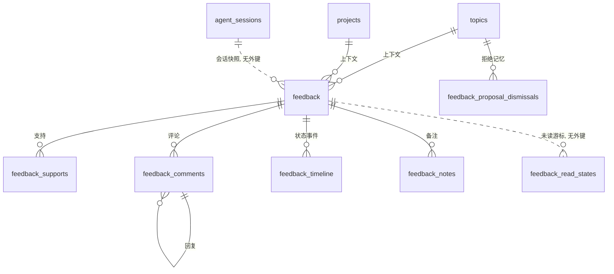
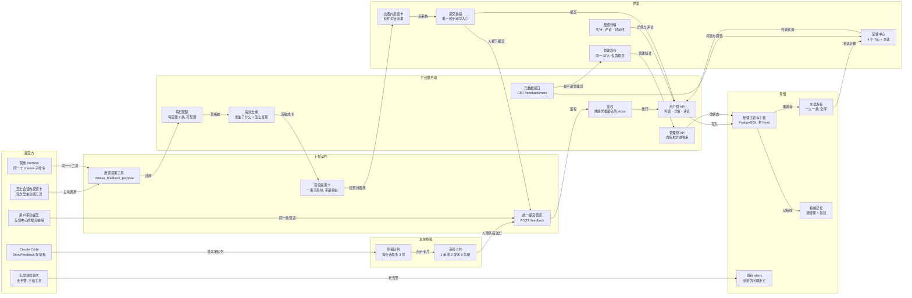

# Feedback 前端原型

## 目标

做一套「反馈」功能：**界面**（反馈中心、单条详情、我的反馈、管理员处理台）、**后端**（三条路由 + 七张表）、以及**每个 harness 主动提反馈的通道**。

顺序是先在话题里把界面口径和产品判断定完，再照一份能照着实现的方案稿落代码。标题里的「原型」是起点：界面先是可点的原型（不是稿图），确认信息结构和操作合适之后才接真接口——现在接上了，所以这份文档覆盖的是整套功能，不只是原型。

产出物：

- 代码：PR [#1222](https://github.com/SageSeekerSociety/cheese/pull/1222)，前后端在**同一个 PR**里。
- 设计依据：<&docs/topics/反馈功能后端设计-方案稿.md>，代码里每一个判断都能在这里找到出处。
- 表与关系、数据流两张图：写在下面「表与关系 / 数据流」一节里（原来是一个 `/design/feedback` 页面，已删）。

## 现状（2026-09-19）

功能已经实现并推上 PR #1222，**待人工验收**（验收人 wangchangxin）。这一轮推的是新提交，上一轮没有有效批准，所以没有需要作废的批准。

- **后端**：七张新表，迁移 `backend/alembic/versions/b7c2e91f4a03_feedback.py`；三条路由 `/api/feedback`、`/api/admin/feedback`、`/api/topics/{id}/feedback-proposals`；域层在 `backend/app/domain/feedback/`（models / repositories / services / schemas / proposals）。私有反馈的可见性是**读时收窄**：`services.may_see` 一处决定谁能看，仓储层不回答策略问题。
- **前端**：四个页面读真接口（反馈中心、反馈详情、**我的反馈**、管理后台）。`stores/feedback.ts` 调 API，上一版那个内存 mock（`lib/feedbackMock.ts`）已经删掉——界面不再是「照着自己编的数据画」。
- **CLI**：`cheese feedback propose` 进了 argparse 树，三个 harness 同时就有了这个工具（见下）。
- **合并了 main 的 35 个提交**。合并带出一处**语义**冲突，已修：main 的 `f3a8c5d2e917` 把 agent 身份从「由话题派生」改成「属于 agent 自己」（`agent_instance_handle`），而我的测试原本按话题算 handle 再断言卡片的作者。现在改成从卡片上读作者，断言「是 agent、且不是提单的人」——身份不由反馈代码算。
- **状态收敛成四级**：`received → in_progress → resolved → deployed`（已收录 / 处理中 / 已修复 / 已上线）。写稿时是五级（`triaging` / `planned` 也在内），验收时看界面发现「评估中」和「处理中」在人眼里是同一件事、「计划中」说不清是谁在动；同时把「修复」和「上线」拆成两档——改完和上线是两件事，同名会让提交者以为自己这边马上就能用了。口径与代价见 <&docs/topics/反馈功能后端设计-方案稿.md> §2.5。
- **两条端到端实跑**（<&e2e/tests/feedback-flows.spec.ts>）：用户提交 → 列表看见 → 支持 → 评论 → **在「我的反馈」里找回自己那条** → 详情页看到状态；管理员把同一条四级走完，连带指派、优先级、内部备注。真浏览器点的，不是接口层调用。

### 「我的反馈」（`/feedback/mine`）

补上的一页：`GET /feedback/mine` 从第一版就在，api.ts 里也包了 `listMyFeedback()`，但**没有任何页面调它**——用户提完反馈之后没法在界面上找回自己那条，只能在一屏十几条里翻。

- 清单的边界是**服务端**的定义：我提的 + 我替谁提的（agent 报的、提交人是我）+ 指派给我的。前端不按来源分栏——那需要每条带一个「为什么它在我的清单里」，服务端还没有这个字段，而按 handle 在前端猜一遍等于把可见性规则抄第二份。
- 卡片直接复用 <&frontend/src/components/feedback/FeedbackCard.vue>：同一条反馈在两页上长得一样，支持按钮也照用（store 的 `_find` / `_patch` 覆盖了 `mineItems`，漏掉的表现是按钮点下去没反应、连错误都不报）。
- 入口在反馈中心页头「我的反馈」。四种状态（加载中 / 有内容 / 一条没有 / 拉失败）各画各的：拉失败不会说成「你还没有提过反馈」。

**看界面**：预览是开着的，形态是**真页面 + 假数据**。预览通道上没有后端，所以我在预览入口的 `fetch` 那一层接上了假数据（<&frontend/src/proto-feedback-fixtures.ts>），页面本身一行都没改、走的是真接口。页面可交互：能点进详情、能进「我的反馈」、能切管理端四栏、能筛选、能搜索。打包脚本是 <&pack-feedback-prototype.py>，改完页面重跑即可。

## 界面打磨时定下的（之后改界面要沿用）

- **一屏只有一个琥珀色主操作**，且主操作按钮必须显式写 `color="primary"`——Vuetify 的裸 `<v-btn>` 渲染出来是白底按钮，不会用主题色。三屏各自的落点：反馈中心「提交反馈」、详情页「发表评论」、管理员台没有（状态/优先级/指派是选完即生效的选择框，琥珀只用在当前选项卡上）。
- 支持按钮做成中性 tonal（`secondary` + `mdi-thumb-up-outline` / `mdi-thumb-up`），把琥珀色让给主操作；三个非颜色信号（形状、图标、文案）都随状态变。
- 正文级文字不用 `--faint`（对比度 2.6:1，只够放元信息），用 `--muted`。
- 管理员表格用 `:deep()` 选择器压过 Vuetify 自带的 th/td 规则，不写 `!important`。
- 顺手修了一个仓库级 bug：`color="primary"` 的禁用按钮因为 `.bg-primary` 带了 `!important`，看起来仍然可点，而 `pointer-events: none` 又把点击吞掉。修在 `frontend/src/style.css`，对所有实心按钮生效。

## 表与关系 / 数据流

这两张图原先是一个页面（`/design/feedback`，页头叫「数据与架构」）。**页面删了，图挪到这里**：那一页是给自己核对实现用的，而它挂在应用里，用户会当成一个功能点进去，然后看到一屏看不懂的表名。图留在文档里有同样的核对作用，还不会被当成承诺。

删掉的还有画图那几个文件（`views/feedback/FeedbackDesignPage.vue`、`components/diagram/`、`lib/feedbackDiagram.ts`、`lib/diagramSpec.ts`）。代价说明白：图不再是「改了代码就会一起改」的东西了——**列清单以 <&backend/app/domain/feedback/models.py> 为准**，下面只留判断（哪张表为什么这样开、哪条链为什么绕），那些是代码里读不出来的。

**表与关系**：新建七张表——六张挂在 `feedback` 上，拒绝记忆挂在话题上；另有三张既有表被牵动。实线 = 有真外键，虚线 = 只存快照、不建外键。

几条从代码里读不出来的判断：

- **话题与项目是真外键**（可空，`SET NULL`）：删话题不会删反馈，只把指针置空。但删话题**会**删掉那条话题的拒绝记忆（那张表是 `CASCADE`）。
- **会话只存 id 快照**（`session_id` 是 `String(64)`，刻意不建外键）：会话删了，反馈要留下。
- **`author_is_agent` 与 `submitted_by_handle` 是两个人**：agent 发现、人按下提交。可见性查询要同时算 `author_handle` 与 `submitted_by_handle` 就是这个原因。
- **`security` 不是第二个开关**，是 `private` 之下的一层读时收窄。索引 `(visibility, security, created_at)` 就是为这次收窄建的。
- **`tags` 是 JSON 列，不建标签表**；`deleted_at` 留着，但**还没有端点会写它**。
- **`feedback_notes` 不把备注写成主表的字符串列**——两个管理员在同一行上互相覆盖。
- **`feedback_read_states` 是一人一条游标**，不是逐条已读表：未读 = 「比我上次读的时间更新的动静」。
- **`feedback_comments` 只有两层**：`parent_id` 只指顶层评论，回复的回复由服务端改挂到它所在的顶层评论上。
- **`feedback_proposal_dismissals` 的指纹不是 block id**：换个说法把同一件事提上来，人不想再看第二遍。
- **既有表 `alerts` 没有用它**：它的 `project_id` 非空，而反馈没有项目。巡检的问题走它，反馈走 `feedback`。

**数据流**：六条泳道。两条提交通道最后都落到 `feedback` 表——人直接写，agent 先成为提案卡、由人在卡上按提交。

## 三条产品判断（需求方答复 + 落代码时取的默认值）

- **私密反馈，提交者本人可见**。可见的人是「提交者本人 + 平台管理员 + 提出它时在那个房间里、且今天还读得到那个房间的人」（结论 47，见方案稿 §4.3）；查询同时算 `author_handle` 与 `submitted_by_handle`，因为 agent 提案、人确认提交的那一类两者不同。
- **反馈中心是平台共享的，不以组织（Space）为单位**。「公开」= 对所有登录用户公开；`project_id` 只是**出处**，不是可见性范围。`topic_id` 两样都是：它既是出处，也是上面那一档的授权键——所以它不由客户端填，由发送提案卡的那个端点从 URL 解出来。
- **默认不展示已解决的 bug**，取窄读法：**只沉底已解决的 bug**，已解决的 suggestion 不沉。
- **§8.1 谁算平台管理员** → `settings.feedback_admin_handles` 白名单（照 `dogfood_owner_handles` 的先例）。不点亮 `SystemRole.SUPER_ADMIN`，那要动 1.0 的权限框架。
- **§8.3 `security` 与 `visibility`** → `security` 是 `private` 之下的一层**读时收窄**，不覆写提交者自己选的 `visibility`。

后两条是落代码时按方案稿的建议取的默认值，每处都是常量或一处判断，验收人要改随时改。

## 每个 harness 怎么主动提反馈

结论比预想的短：**加一个 CLI 叶子命令就够，不用写三遍。**

三个 harness 取的是**同一份东西**——平台 CLI（`backend/sandbox/cheese`）的 argparse 树：

- claude_code：会话里的 MCP 服务器把 `cli {method:"tools/list"}` 发给 executor，由 `cli_worker` 把 argparse 树转成工具 schema。
- pi：没有 MCP，`harness/pi/catalog.py` 直接读机器上装着的那个 CLI，`platform.ts` 再把每个注册成 pi 的原生工具。
- codex：从 executor 的 `native` 服务器和其余 MCP 服务器发现，平台工具随它那份 CLI 一起来。

所以 `cheese feedback propose` 加进那棵树，三个 harness 同时就有了。两条值得记住的推论：**工具名是算出来的**（`feedback propose` → `cheese_feedback_propose`），**`help=` 就是工具 schema**（写进 argparse 的措辞直接是模型看到的那份，不存在文档和实现漂移）。另外，「无屏巡检轮次不给这个工具」不需要专门实现——该命令和 `cheese chat send` 一样要 `CHEESE_TOPIC`，巡检轮次没有话题，命令自己就拒绝；**门在服务端，不在工具清单上**。

## agent 只能提案，不能发布

`cheese feedback propose` 落下的是一张**提案卡**，不是反馈。人在聊天里按「提交反馈」才算发布。所以发送之后 `author_handle` 是卡上那个 agent、`submitted_by_handle` 是按按钮的人——两个字段，「芝士提的反馈里有多少真的被人发出去」才答得出来。

三道限流（同话题一天两张、同一个指纹提过、被「不用」过）各自回 412，因为它们对客户端的指令是同一句：别重试。被「不用」过这件事记在 `feedback_proposal_dismissals` 上——消息块不落表，但拒绝必须留下，否则同一个问题每轮都会再问一遍。

## 预览当测试用例跑，查出两个真 bug（已修）

界面接到真接口之后，冷启动（刷新或深链）才是第一次有人真的走那条路。两个都是这样发现的：

- **直接打开 `/admin/feedback` 是一张空表**。`onMounted` 没 `await loadMeta()`，于是 `store.isAdmin` 读到的永远是「还不是管理员」，列表压根不拉。从反馈中心点进去反而正常，因为那边已经把 meta 拉过了。
- **深链进详情页点「支持」没反应**。`_find` 只找列表和 `adminItems`，而那条路上两份都是空的；补上对 `detail` 的兜底才闭环。

## 端到端实跑又查出两个（已修）

上一节那两个是**冷启动**才露出来的；这两个更隐蔽——**三套门禁全绿、页面看起来也对**：

- **管理端详情抽屉里的头像从来没画出来**。`AdminFeedbackDetailDrawer.vue` 用了两次
  `FeedbackAuthorAvatar`，却一行 import 都没写。typecheck 不看模板、eslint 不看模板、
  单测没渲染过那个抽屉，只有 Vue 在控制台小声说一句「Failed to resolve component」，
  页面上那个位置就是空的。补 import 之外，e2e 里加了**控制台守卫**：用例跑完控制台
  里但凡有 error 或有没注册的组件就红——这类事以后第一次跑就拦下。
- **已上线的反馈，支持按钮还是亮的**。判断写成了 `status !== 'resolved'`，漏掉新加的
  `deployed`：按钮说能做、点下去服务端回 412。两处（列表卡片、详情页）各写了一遍同样的
  错，谁也发现不了谁。现在抽成 <&frontend/src/lib/feedbackMeta.ts> 的 `isClosed()`，
  它是服务端 `CLOSED_STATUSES` 在**前端**的同一份镜像，两处共用。

## 验证

- 后端：`tests/integration/test_feedback.py` + `tests/unit/test_cli_worker.py` 通过。集成测试钉的是**产品判断**（私密对第三方回 404 而不是 403、已解决 bug 沉底、agent 不能自己发布、提案三道限流、退役状态写不进去），不是接口形状。
- 前端：tsc ratchet 0、eslint 0 error、stylelint 基线、反馈相关 vitest 37 条通过（含「我的反馈」那 4 条：挂载就拉、拉失败不冒充空、空态给提交入口、在这一页点支持计数走服务端）。
- 端到端：`e2e/tests/feedback-flows.spec.ts` 两条全流程通过（真浏览器，含控制台守卫）。
- 合并 main 之后以上全部重跑过。

**跑 e2e 要自己搭一套环境**（这套是本机实测出来的）：后端 `127.0.0.1:8123`（指向另建的
`cheese_fbe2e` 库，共享开发库停在 `f3a8c5d2e917`、没有 feedback 的表）、redis 在 6399
（6379 上没有）、vite 在 3111 且 `BACKEND_URL` 指到 8123；后端要带
`FEEDBACK_ADMIN_HANDLES='["alice"]'`，否则管理端一进去就是 403（playwright 配置里给
webServer 加了这一条）。`/tmp` 的 inode 在本机是满的，playwright 得用
`TMPDIR=/var/tmp/…` 绕开。

**本机跑测试的坑**：并发跑的测试进程会共用同名测试库，而它们是用 `DROP DATABASE ... WITH (FORCE)` 建的——两个 run 撞上会把对方的库拆掉，症状是随机 403 和 KeyError。带一个 `CHEESE_CI_SLOT=<任意串>` 就有自己的库名了（见 `backend/tests/isolation.py`）。

## 下一步

1. 等 PR #1222 的 CI 与 @符露夀 的验收。推新提交会清掉上一轮的批准，所以验收人看到的就是这一版。
2. 验收人若要改上面那两条默认值（管理员白名单、security 读时收窄），都是小改。
3. 方案稿 §8 里还剩十几条细节问题，都是实现里已经取了默认值的，可以顺验收一起过。

### 已知缺口，这一版没堵

按「先做完再好看」的次序，下面几条是**知道在哪、也知道怎么补**、但没塞进这个 PR 的：

- **头像文件与头像表不同步**。库里 2/3/4 号（猫咪/柴犬/熊猫，`predefined`）有行、磁盘上
  没有对应文件，于是 `GET /avatars/{id}` 回 404。这不是反馈这一屏的事：**任何新部署的
  项目磁贴都会缺图**，因为种子只给默认头像写了文件。浏览器控制台里那几条 404 就是它，
  e2e 里按形状放行并留了注释（放行的是 `/api/avatars/{id}` 这一个形状，反馈自己的请求挂掉
  照样红）。补种子会影响别的测试，所以没在这里顺手改。
- **`live_cards` 的读取成本**。`proposals.py` 里它把该话题**所有**带 meta 的消息块读出来、
  在 Python 里过滤，而它挂在「加载聊天列」这条路上。话题消息一多就是一次全表扫描式的读。
  今天话题的消息量撑得住，所以没有提前优化；真要做，是把过滤下推成 SQL（`meta` 上已有
  可用的索引形状）而不是加缓存。
